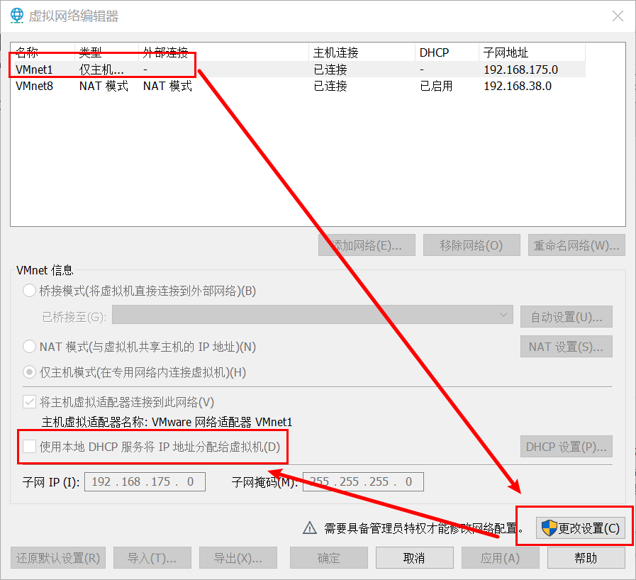
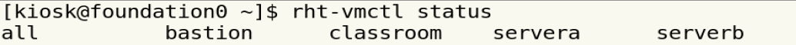
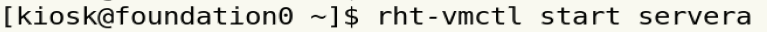
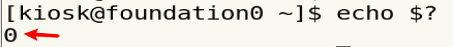
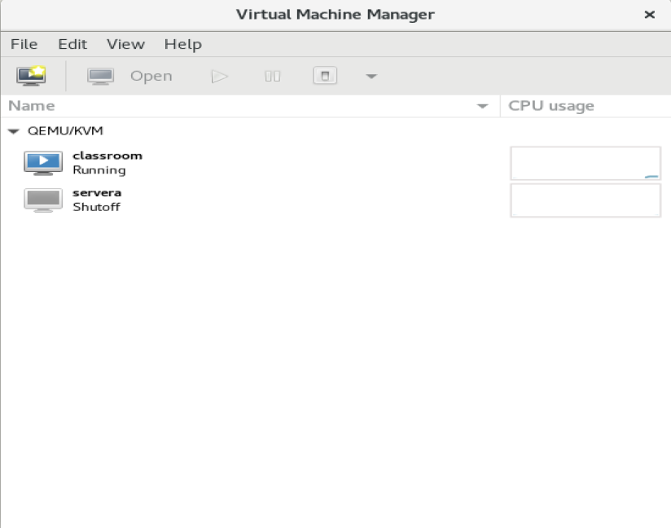

# 环境配置

关闭VMware dhcp ：编辑 -> 虚拟网络编辑器



关闭杀毒软件

内存需求：至少3G

# 虚拟机启动

```
查看虚拟机状态 ：rht-vmctl status
```



```
启动虚拟机： rht-vmctl start 
```




```
登录虚拟机 ：rht-vmview view 
```


```
检查命令是否执行正确 echo $?
```



```
虚拟机管理软件 vrt-manager
```




# 终端切换

|      |               |              |
| ---- | ------------- | ------------ |
| 字符 | <Ctrl+Alt+Fx> | x in（2，6） |
| 桌面 | <Ctrl+Alt+F1> |              |

# prompt

```
who am i :查看当前用户
hostname :查看当前主机名
pwd :查看当前路径
<Ctrl+d>:注销
```

# 关机重启

|      |        关机        |       重启       |
| ---- | :----------------: | :--------------: |
|      |       init 0       |      init 6      |
|      |      poweroff      |      reboot      |
|      | systemctl poweroff | systemctl reboot |
|      |   shutdown -h 0    |  shutdown -r 0   |

# 回显式命令

```
date
date +%R
date +%y%m%d
```

# 交互式命令

```
passwd
```

# 查看文件内容

|        |                            |                                           |
| ------ | -------------------------- | ----------------------------------------- |
| cat    | cat  -n  /var/log/messages |                                           |
| more   | more  /var/log/messages    | <space>,<q>                               |
| less   | less  /var/log/messages    | <space>,<q>,<Arrow up>,<Arrow Down>,/word |
| head   | head  /var/log/messages    | 显示文件头10行信息 -n 2                   |
| tail   | tail   /var/log/messages   | 显示文件尾10行信息 -n 3                   |
| vim/vi | vim /var/log/messages      | ：q                                       |

# TAB

功能：一下补全，两下列出

对象：命令、路径、选项

# history

```
history
ls -a ~/.bash_history
history -a 
!num
!cha
```

|      | file  | folder   |
| ---- | ----- | -------- |
| 创建 | touch | mkdir -p |
| 改名 | mv    | mv       |
| 移动 | mv    | mv       |
| 拷贝 | cp    | cp -r    |
| 删除 | rm    | rm -r    |

