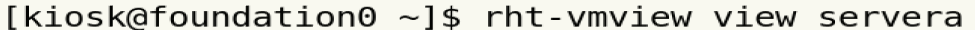

# 环境配置

关闭VMware dhcp ：编辑 -> 虚拟网络编辑器


关闭杀毒软件

内存需求：至少3G

# 虚拟机启动

```
查看虚拟机状态 ：rht-vmctl status
```


```
启动虚拟机： rht-vmctl start 
```


```
登录虚拟机 ：rht-vmview view 
```



```
检查命令是否执行正确 echo $?
```


# 终端切换

|      |               |              |
| ---- | ------------- | ------------ |
| 字符 | <Ctrl+Alt+Fx> | x in（2，6） |
| 桌面 | <Ctrl+Alt+F1> |              |

# prompt

```
who am i :查看当前用户
hostname :查看当前主机名
pwd :查看当前路径
<Ctrl+d>:注销
```

