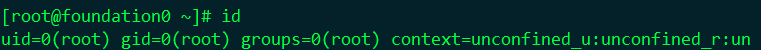
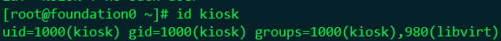

# 终端快捷键

|      | <kbd>ESC</kbd>+<kbd>.</kbd> | 自动粘贴上一条命令最后一个词，到光标所在位置 |
| ---- | :-------------------------: | -------------------------------------------- |
|      |                             |                                              |


# 重定向

## >、>>

```bash
[kiosk@foundation0 ~]$ echo haha > 1.txt
[kiosk@foundation0 ~]$ echo haha >> 2.txt
[kiosk@foundation0 ~]$ cat 1.txt
haha
[kiosk@foundation0 ~]$ cat 2.txt 
haha
[kiosk@foundation0 ~]$ echo hehe > 1.txt
[kiosk@foundation0 ~]$ echo hehe >> 2.txt 
[kiosk@foundation0 ~]$ cat 1.txt 
hehe
[kiosk@foundation0 ~]$ cat 2.txt 
haha
hehe
[kiosk@foundation0 ~]$ # 1=正常输出 2=错误输出 &=1+2
[kiosk@foundation0 ~]$ echo zheng 1> new.txt
[kiosk@foundation0 ~]$ cat new.txt 
zheng
[kiosk@foundation0 ~]$ echo zheng 2>new.txt 
zheng
[kiosk@foundation0 ~]$ cat new.txt 
[kiosk@foundation0 ~]$ echo zhu &>all.txt
[kiosk@foundation0 ~]$ cat all.txt 
zhu
[kiosk@foundation0 ~]$ Echo zhu &> all.txt 
[kiosk@foundation0 ~]$ cat all.txt 
bash: Echo: command not found...
Similar command is: 'echo'

[kiosk@foundation0 ~]$ echo haha > new.wj 2>> new.wj
[kiosk@foundation0 ~]$ cat new.wj 
haha

find / -user kiosk 2> /dev/null #错误输出全部丢进黑洞
```

## <,<<

```
[kiosk@foundation0 ~]$ wc < push.txt 
  48  107 2618
#<< 定义中止符
[kiosk@foundation0 ~]$ cat > new1.txt <<sbzhutao 
> shabizhutao
> sbzhutao
[kiosk@foundation0 ~]$ cat new1.txt 
shabizhutao

```

## |，tee

```
|：管道
tee：一输入两输出
```

## vim

```
# vim chuangjian.txt
<i>
<ESC>
:wq!
```

|        | cha                                 | word                                                        | line                                 |
| ------ | ----------------------------------- | ----------------------------------------------------------- | ------------------------------------ |
| :set   | :set number                         |                                                             |                                      |
| Go     | <kbd>G</kbd>,n<kbd>G</kbd> 跳转行号 | <kbd>g</kbd><kbd>g</kbd>,n<kbd>g</kbd><kbd>g</kbd> 跳转行号 | ：`line-number`                      |
| word   | <kbd>w</kbd> 单词跳转往后           | <kbd>b</kbd>单词跳转往前                                    |                                      |
| delete | <kbd>x</kbd>                        |                                                             | <kbd>d</kbd><kbd>d</kbd>             |
| 选中   | <kbd>v</kbd>                        | <kbd>Shift</kbd>+<kbd>v</kbd>                               |                                      |
| 复制   | <kbd>y</kbd>                        |                                                             | <kbd>n</kbd><kbd>y</kbd><kbd>y</kbd> |
| 粘贴   | <kbd>p</kbd>                        |                                                             |                                      |
| 撤销   | <kbd>u</kbd>                        |                                                             |                                      |

## 变量

## 用户和组





## &&,||

```bash
echo dui && echo zhixing
echo cuo || echo zhixing
```

