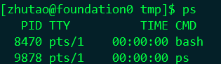
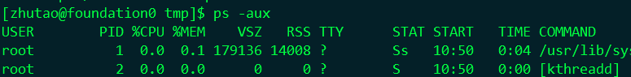
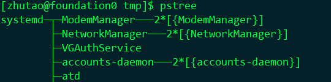
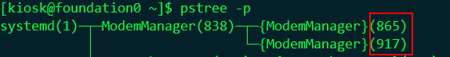
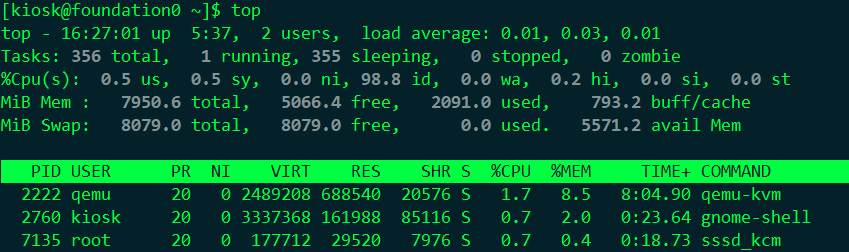
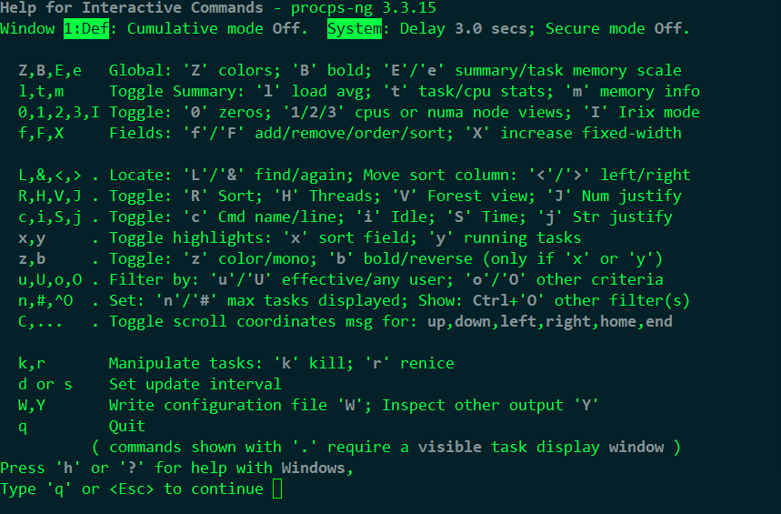
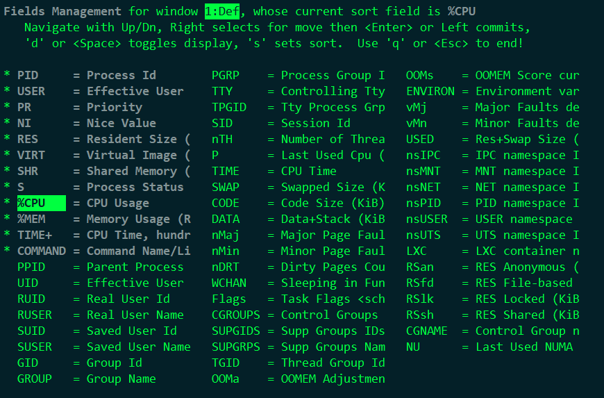
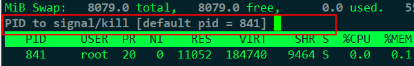

# 权限

|      |       | 文件 |  文件夹  |
| :--: | :---: | :--: | :------: |
|  r   | read  |  看  |  看内容  |
|  w   | write |  写  |   新建   |
|  x   | 执行  | 脚本 | 进文件夹 |

| rwx  |      |      |
| ---- | ---- | ---- |
| r--  | 4    |      |
| -w-  | 2    |      |
| --x  | 1    |      |

| u    | user  |      |
| ---- | ----- | ---- |
| g    | Group |      |
| o    | other |      |
| a    | all   |      |

## chmod、chown、suid、sgid、stick

```bash
#ls -l
[root@foundation0 ~]# ls -l /etc/fstab 
-rw-r--r--. 1 root root 996 Oct 18  2019 /etc/fstab
#chmod 
[kiosk@foundation0 ~]$ chmod g+w,o=- a.txt 
[kiosk@foundation0 ~]$ chmod go=rx a.txt 
[kiosk@foundation0 ~]$ chmod 755 a.txt 
[kiosk@foundation0 ~]$ chmod -R 755 a.txt  #R为递归，意思是将文件及文件内的东西权限全部改为755

#chown
chown kiosk:bin  a.txt
chown kiosk  a.txt
chown :bin  a.txt
chown -R kiosk:bin  a.txt

#suid=4=s普通用户拥有该命令所属用户的身份执行，只对命令或者可执行文件有效，对普通文件或者目录无效
#用户或属主对应的前三位权限的x位上如果有s就表示suid权限。当x位上没有小写x执行权限的时候，suid的权限显示的就是大S。
[root@foundation0 ~]# chmod u+s /bin/vim
[root@foundation0 ~]# ls -l /bin/vim
-rwsr-xr-x. 1 root root 3096552 Dec  6  2018 /bin/vim
[kiosk@foundation0 ~]$ vim /tmp/z.txt 
[kiosk@foundation0 ~]$ cat /tmp/z.txt 
dadasdas:
idasdasd

#sgid=2=s 当一个目录存在sgid权限时，不管是谁创建的文件都不属于创建者的组而是属于文件夹的组，对目录有效对文件无效
[root@foundation0 tmp]# mkdir folder
[root@foundation0 tmp]# ls -ld folder/
drwxr-xr-x. 2 root root 6 Oct 17 14:02 folder/
[root@foundation0 tmp]# chown :kiosk folder/
[root@foundation0 tmp]# ls -ld folder/
drwxr-xr-x. 2 root kiosk 6 Oct 17 14:02 folder/
[root@foundation0 tmp]# chmod g+s folder/
[root@foundation0 tmp]# ls -ld folder/
drwxr-sr-x. 2 root kiosk 6 Oct 17 14:02 folder/
[root@foundation0 tmp]# touch folder/zhutou
[root@foundation0 tmp]# ls -ld folder/{.,*}
drwxr-sr-x. 2 root kiosk 20 Oct 17 14:04 folder/.
-rw-r--r--. 1 root kiosk  0 Oct 17 14:04 folder/zhutou

#stick=1=t 适用于目录，只有创建者或root用户可以进行删除，其他用户无法进行删除
[root@foundation0 tmp]#  su - kiosk 
[kiosk@foundation0 ~]$ cd /tmp/
[kiosk@foundation0 tmp]$ mkdir hululu
[kiosk@foundation0 tmp]$ touch hululu/{1..3}.txt
[kiosk@foundation0 tmp]$ ls hululu/
1.txt  2.txt  3.txt
[kiosk@foundation0 tmp]$ rm -rf hululu/1.txt 
[kiosk@foundation0 tmp]$ ls hululu/
2.txt  3.txt
[kiosk@foundation0 tmp]$ su - 
[root@foundation0 ~]# cd /tmp/
[root@foundation0 tmp]# rm -rf hululu/2.txt 
[root@foundation0 tmp]# ls hululu/
3.txt
[root@foundation0 tmp]# su - zhutao
[zhutao@foundation0 ~]$ cd /tmp/
[zhutao@foundation0 tmp]$ rm -rf hululu/3.txt 
rm: cannot remove 'hululu/3.txt': Permission denied


```

## umask

```bash
#umask = 默认0002
文件夹=777 - umask
文件=666 - umask
```

# Linux进程

1、ps



2、ps  -aux  = a:all ;u:user; x:nouser



USER :用户名

COMMAND ：命令

PID：ID

%CPU：CPU

%MEM：内存

VSZ：虚拟内存

RSS：实际内存

TTY:终端

STAT：状态； Ss：S：休眠 s：子进程

START：启动

TIME：启动了多少时间

3、pstree 



-p  ：查看ID



4、top



按h获得帮助



按f选择排序



按k结束进程



jobs

```bash
#jobs
dd if=/dev/zero of=/dev/null bs=1k
<Ctrl-Z>
#jobs
#bg [1]将一个在后台暂停的命令，变成继续执行
dd if=/dev/zero of=/dev/null bs=1k &
#jobs
fg [1] 把相应的进程拉回前台
<ctrl-C>
kill %1 
```

pgrep

```bash
pgrep #过滤相应进程
[kiosk@foundation0 ~]$ pgrep  bash 
38197
```

查看CPU负载

```bash
#top
#uptime
#w
```

# 控制服务和守护进程

## 启动服务

```
[kiosk@foundation0 ~]$ systemctl start sshd
```

## 查看服务状态

```
[kiosk@foundation0 ~]$ systemctl status sshd
● sshd.service - OpenSSH server daemon
   Loaded: loaded (/usr/lib/systemd/system/sshd.service; enabled; vendor preset: ena>
   Active: active (running) since Tue 2020-10-13 03:56:16 CST; 6 days ago
[kiosk@foundation0 ~]$ systemctl status sshd -l  #l：详细查看服务状态
```

## 停止服务

```
[kiosk@foundation0 ~]$ systemctl stop sshd
```

## 重启服务

```
[kiosk@foundation0 ~]$ systemctl restart sshd
```

## 开机不启动

```
[kiosk@foundation0 ~]$ systemctl disabled sshd
```

## 查看开机是否启动

```
[kiosk@foundation0 ~]$ systemctl is-enabled sshd
```

## 查看服务是否活动

```
[kiosk@foundation0 ~]$ systemctl is-active sshd
```

## 重新加载配置服务

```
[kiosk@foundation0 ~]$ systemctl reload sshd #不会重启进程，仅仅加载配置文件
```

## 屏蔽服务/取消屏蔽服务

```
[kiosk@foundation0 ~]$ systemctl mask sshd
[kiosk@foundation0 ~]$ systemctl unmask sshd
```

## 一个服务的启动依赖单元配置文件

## 单元配置文件

[kiosk@foundation0 ~]$ cat /usr/lib/systemd/system/httpd.service

## 为什么叫单元配置文件

systemctl工具 根据你服务类型的不同划分了不同类型的单元

service

​	和服务有关的单元

target

​	和启动有关的单元

socket

​	套接字服务 （telnet）

device

slice


