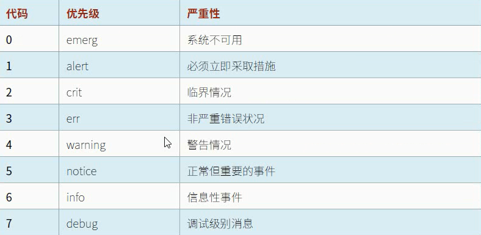

# SSH访问远程命令行

ssh服务默认启动

命令：ssh  root（远程服务器用户名） @server（服务器的IP地址或者域名）

1、如果是第一次连接：SSH Server会把自己的公钥发送给Client

​	SSH的公钥怎么来的？

​	SSH服务在启动的时候会在/etc/ssh/*host* 生成密钥对，如果没有密钥会新建，如果有不会做操作

```
[kiosk@foundation0 ~]$ ll /etc/ssh/*host*
-rw-r-----. 1 root ssh_keys  480 Oct 18  2019 /etc/ssh/ssh_host_ecdsa_key
-rw-r--r--. 1 root root      162 Oct 18  2019 /etc/ssh/ssh_host_ecdsa_key.pub
-rw-r-----. 1 root ssh_keys  387 Oct 18  2019 /etc/ssh/ssh_host_ed25519_key
-rw-r--r--. 1 root root       82 Oct 18  2019 /etc/ssh/ssh_host_ed25519_key.pub
-rw-r-----. 1 root ssh_keys 1799 Oct 18  2019 /etc/ssh/ssh_host_rsa_key
-rw-r--r--. 1 root root      382 Oct 18  2019 /etc/ssh/ssh_host_rsa_key.pub
```

2、如果client是第一次连接，那么client需要接受服务器的公钥，把服务器的公钥保存在当前用户的/home/kiosk/.ssh/下

​	如果client保留了server的公钥，将不会再重新保存，而是比对之前的保存的公钥是否一致，如果不一致需要删除原先的公钥并且让他重新接收

3、client输入被验证用户的密码

4、ssh会话，加密的会话（client会产生一个随机值：将来用作对称加密的密码。server的公钥加密）

5、server拿自己的私钥解开这个随机值

6、client和server之间的通信都是通过随机值加密

## client连接

```
[kiosk@foundation0]$ ssh root@192.168.1.100
	root：服务器端的用户
	192.168.1.100：服务器的IP地址
	-X：允许x11图形化转发
仅仅是执行一个命令。命令结束之后，打开的shell进程就会关闭
[kiosk@foundation0]$ ssh root@192.168.1.100 hostname
如果再连接的时候，不带用户就会以客户端的当前用户连接
```

## SSH密钥身份认证

SSH时，输入该用户的用户名和密码（基于用户名密码验证）

基于公钥验证：client在连接服务器的时候，不需要输入密码（基于公钥验证）

- Client会发自己的公钥给Server，Server会保存Client的公钥

- Client会用自己的私钥做签名

- Server只需要拿着客户端的公钥就能验证Client的身份是合法的

  1、客户端要产生一个密钥对

  ```bash
  [kiosk@foundation0 .ssh]$ ssh-keygen 
  Generating public/private rsa key pair.
  Enter file in which to save the key (/home/kiosk/.ssh/id_rsa):  #私钥保存位置
  Enter passphrase (empty for no passphrase): #是否需要使用密码保护私钥
  Enter same passphrase again: 
  Your identification has been saved in /home/kiosk/.ssh/id_rsa.
  Your public key has been saved in /home/kiosk/.ssh/id_rsa.pub. #公钥路径
  The key fingerprint is:
  SHA256:0K3i2TZRUBVv7f7ioXQTOOVkPzOGBxJduw4/IQSw5R8 kiosk@foundation0.ilt.example.com
  The key's randomart image is:
  ```

  2、客户端要把公钥传输给Server

  ```bash
  [kiosk@foundation0 .ssh]$ ssh-copy-id root@192.168.1.100
  ssh-copy-id :会去当前用户的/root/.ssh/id_rsa.pub传给server端的/root/.ssh/authorized_keys
  ```

  3、一旦Client连接，用私钥做个签名并且发送给Server

  4、Server就可以拿着Client的公钥去验证签名

  Q1:

  切换用户之后如何使用基于公钥验证？

  1、重新创建密钥对

  2、拷贝原有的密钥对至当前用户并且更改所有这个和所有组

  Q2:

  服务器端更改用户，Client登陆时需要密码如何解决

  1、执行ssh-copy-id将公钥文件传给新用户的家目录

  2、拷贝原有的公钥文件至新用户家目录

# 日志服务

日志服务：rsyslog.service（其他类型的日志）和systemd-journald.service （记录服务有关日志）

systemd-journald.service ：仅仅记录服务有关的日志，且日志默认情况下记录在内存当中

rsyslog.service：记录其他类型日志，配置文件：/etc/rsyslog.conf 

/etc/rsyslog.conf 内定义的是哪种类型的日志的哪个级别记录在哪个文件内

```bash
*.info;mail.none;authpriv.none;cron.none                /var/log/messages
*任何一种类型日志的info级别
authpriv.*                                              /var/log/secure
和认证有关的所有日志都记录在/var/log/secure中
mail.*                                                  -/var/log/maillog
邮件有关
cron.*                                                  /var/log/cron
和计划任务有关的日志
*.emerg                                                 :omusrmsg:*
严重级别的日志在任何终端都会显示
local7.*                                                /var/log/boot.log
开机相关的日志
```

## 日志级别



- 4~7不影响系统的作业

## 日志结构

```
Oct 20 15:21:35 foundation0 named[1028]: network unreachable resolving './DNSKEY/IN': 2001:dc3::35#53

Oct 20 15:21:35：时间
foundation0:主机
named[1028]:服务进程
network unreachable resolving './DNSKEY/IN': 2001:dc3::35#53 :事件
```

## 日志轮替

### 定义轮替方式：

1、当你的日志文件 > 某个大小 ；重命名 /var/log/messages-xx（旧）  /var/log/messagess（新）

2、定义周期：每周或者每天 ；/var/log/messages-xx（旧）  /var/log/messagess（新）

3、日志的保留份数：/var/log/messages-xx（旧） +  /var/log/messagess（新）最多保留几份

### 日志轮替配置文件

vim /etc/logrotate.conf 

```bash
# see "man logrotate" for details
# rotate log files weekly
weekly 

# keep 4 weeks worth of backlogs
rotate 4

# create new (empty) log files after rotating old ones
create

# use date as a suffix of the rotated file
dateext

# uncomment this if you want your log files compressed
#compress

# RPM packages drop log rotation information into this directory
include /etc/logrotate.d

# system-specific logs may be also be configured here.

weekly  每周发生一次轮替
rotate 4 保留4份
create 创建一个新文件
dateext 文件名为/var/log/mess-date
```

针对具体的log文件有它自己的轮替方式

## 查看系统服务journald

```bash
[root@foundation0 ~]# journalctl -n 5 #指定5行
-- Logs begin at Tue 2020-10-13 03:56:14 CST, end at Tue 2020-10-20 16:>
Oct 20 16:05:38 foundation0.ilt.example.com su[49237]: pam_succeed_if(s>
Oct 20 16:05:40 foundation0.ilt.example.com su[49237]: FAILED SU (to ro>
Oct 20 16:05:46 foundation0.ilt.example.com su[49249]: (to root) kiosk >
Oct 20 16:05:46 foundation0.ilt.example.com su[49249]: pam_systemd(su-l>
Oct 20 16:05:46 foundation0.ilt.example.com su[49249]: pam_unix(su-l:se>
lines 1-6/6 (END)...skipping...
-- Logs begin at Tue 2020-10-13 03:56:14 CST, end at Tue 2020-10-20 16:05:46 CST. --
Oct 20 16:05:38 foundation0.ilt.example.com su[49237]: pam_succeed_if(su-l:auth): requirement "uid >= 1000" not met by user "root"
Oct 20 16:05:40 foundation0.ilt.example.com su[49237]: FAILED SU (to root) kiosk on pts/1
Oct 20 16:05:46 foundation0.ilt.example.com su[49249]: (to root) kiosk on pts/1
Oct 20 16:05:46 foundation0.ilt.example.com su[49249]: pam_systemd(su-l:session): Cannot create session: Already running in a session or user s>
Oct 20 16:05:46 foundation0.ilt.example.com su[49249]: pam_unix(su-l:session): session opened for user root by kiosk(uid=1000)


[root@foundation0 ~]# journalctl -p err #指定日志级别
-- Logs begin at Tue 2020-10-13 03:56:14 CST, end at Tue 2020-10-20 16:05:46 CST. --
-- Logs begin at Tue 2020-10-13 03:56:14 CST, end at Tue 2020-10-20 16:05:46 CST. --
Oct 13 11:56:11 foundation0.ilt.example.com kernel: [Firmware Bug]: the BIOS has corrupted hw-PMU resources (MSR 38d is 3)
Oct 13 03:56:14 foundation0.ilt.example.com kernel: piix4_smbus 0000:00:07.3: SMBus Host Controller not enabled!

```

如何精确找到某个错误

1、systemctl status xxx -l 查看这个服务有关的所有日志

2、查看某个服务的具体日志文件

## 系统时间

timedatectl

```bash
[root@foundation0 ~]# timedatectl 
               Local time: Tue 2020-10-20 16:22:40 CST
           Universal time: Tue 2020-10-20 08:22:40 UTC
                 RTC time: Tue 2020-10-20 08:21:39
                Time zone: Asia/Shanghai (CST, +0800)
System clock synchronized: no
              NTP service: active
          RTC in local TZ: yes

Warning: The system is configured to read the RTC time in the local time zone.
         This mode cannot be fully supported. It will create various problems
         with time zone changes and daylight saving time adjustments. The RTC
         time is never updated, it relies on external facilities to maintain it.
         If at all possible, use RTC in UTC by calling
         'timedatectl set-local-rtc 0'.

[root@foundation0 ~]# timedatectl  set-time "xxxx-x-x x:x:x" #设置时间
[root@foundation0 ~]# timedatectl  set-timezone "Asia/Shanghai" #设置时区
#不知道时区可以先选择时区 ：tzselect
```

# Network

## IP地址查看

```bash
[kiosk@foundation0 ~]$ ip address show #看的地址全
2: ens160: <BROADCAST,MULTICAST,UP,LOWER_UP> mtu 1500 qdisc mq state UP group default qlen 1000
    link/ether 00:0c:29:ff:8d:54 brd ff:ff:ff:ff:ff:ff
    inet 192.168.207.129/24 brd 192.168.207.255 scope global dynamic noprefixroute ens160
       valid_lft 1693sec preferred_lft 1693sec
    inet6 fe80::7960:a914:c1f6:9f98/64 scope link noprefixroute 
       valid_lft forever preferred_lft forever
# link/ether 00:0c:29:ff:8d:54 brd ff:ff:ff:ff:ff:ff MAC地址
#mtu 1500 最大传输单元
#state UP 状态UP
# inet 192.168.207.129/24 brd 192.168.207.255  IPV4地址和子网掩码
#inet6 fe80::7960:a914:c1f6:9f98/64 IPV6地址
ens160：关于网卡名称说明：在RHEL7以前网卡的名称：eth0 eth1 eth2
RHEL7以后命名和网卡类型有关
 
[kiosk@foundation0 ~]$ ip -s link show  #查看数据包的信息（不常用）
2: ens160: <BROADCAST,MULTICAST,UP,LOWER_UP> mtu 1500 qdisc mq state UP mode DEFAULT group default qlen 1000
    link/ether 00:0c:29:ff:8d:54 brd ff:ff:ff:ff:ff:ff
    RX: bytes  packets  errors  dropped overrun mcast   
    9428227    45119    0       0       0       4750    
    TX: bytes  packets  errors  dropped carrier collsns 
    2877484    16156    0       0       0       0       

[kiosk@foundation0 ~]$ cat /etc//resolv.conf  #查看DNS地址
# Generated by NetworkManager
search localdomain ilt.example.com example.com
nameserver 192.168.207.2 #DNS服务器
nameserver 172.25.254.250

[kiosk@foundation0 ~]$ hostname #主机名的查看
foundation0.ilt.example.com

[kiosk@foundation0 ~]$ route -n #路由信息的查看
Kernel IP routing table
Destination     Gateway         Genmask         Flags Metric Ref    Use Iface
0.0.0.0         192.168.207.2   0.0.0.0         UG    100    0        0 ens160
172.25.0.0      0.0.0.0         255.255.255.0   U     425    0        0 br0

[kiosk@foundation0 ~]$ ping -c 2  www.baidu.com #验证网络连通信 c:写明ping的次数
PING www.a.shifen.com (36.152.44.96) 56(84) bytes of data.
64 bytes from 36.152.44.96 (36.152.44.96): icmp_seq=1 ttl=128 time=10.5 ms
64 bytes from 36.152.44.96 (36.152.44.96): icmp_seq=2 ttl=128 time=10.10 ms

[kiosk@foundation0 ~]$ tracepath www.baidu.com #类似windows的tracert
 1?: [LOCALHOST]                      pmtu 1500
 1:  _gateway                                              0.868ms 
 1:  _gateway                                              0.265ms 


[kiosk@foundation0 ~]$ ss -tunp #查看端口的情况
Netid  State   Recv-Q   Send-Q        Local Address:Port        Peer Address:Port    
tcp    ESTAB   0        52          192.168.207.129:22         192.168.207.1:64393   
tcp    ESTAB   0        0            172.25.254.250:2049      172.25.254.254:874    
t：TCP
u:udp
n：反接 将协议转化为端口
p:显示进程或PID号
l：专门列出当前正在侦听的端口号

```

## IP地址配置

```bash
#在RHEL7包括RHEL7针对网络服务管理的时候有一个服务：network.service;
#从RHEL7以及RHEL8网络服务的管理NetworkManger，所有的网络配置都需要通过NetworkManger来配置
#对于NetworkManger而言
#1、设备是你的网卡
#2、连接
#3、连接文件：网卡配置文件/etc/sysconfig/network-scripts/ifcfg- 
#每个连接都具有标识的名称或ID
[kiosk@foundation0 ~]$ nmcli connection show 
NAME                UUID                                  TYPE      DEVICE  
br1                 5d75d430-2e0e-4dbe-898b-8ce6fc400cac  bridge    br1     
Bridge br0          d2d68553-f97e-7549-7a26-b34a26f29318  bridge    br0     


#设备的管理（物理网卡 device）
[kiosk@foundation0 ~]$ nmcli device status 
DEVICE       TYPE      STATE      CONNECTION         
ens160       ethernet  connected  Wired connection 1 
br0          bridge    connected  Bridge br0 

[kiosk@foundation0 ~]$ nmcli device show ens160
GENERAL.DEVICE:                         ens160
GENERAL.TYPE:                           ethernet
GENERAL.HWADDR:                         00:0C:29:FF:8D:54
GENERAL.MTU:                            1500
GENERAL.STATE:                          100 (connected)
GENERAL.CONNECTION:                     Wired connection 1
GENERAL.CON-PATH:                       /org/freedesktop/NetworkManager/ActiveConnec>
WIRED-PROPERTIES.CARRIER:               on
IP4.ADDRESS[1]:                         192.168.207.129/24
IP4.GATEWAY:                            192.168.207.2

#连接的管理
#1、创建连接；当你需要为一个网络做相关配置的时候，如果这个网卡没有关联的连接，你就可以为这个设置创建一个连接
	[kiosk@foundation0 ~]$ nmcli connection add  type ethernet con-name ens224 ifname ens160 
	type：类型 （以太网）
	con-name：连接名称
	ifname：网卡名称
#2、修改配置：针对某个设备已经关联了连接，或者你自己创建了一个连接，你需要修改配置
	[kiosk@foundation0 ~]$ nmcli connection modify Wired\ connection\ 1 ip
ip4                      ipv4.ignore-auto-dns     ipv6.dns-options
ip6                      ipv4.ignore-auto-routes  ipv6.dns-priority
ipv4.addresses           ipv4.may-fail            ipv6.dns-search
ipv4.dad-timeout         ipv4.method              ipv6.gateway
ipv4.dhcp-client-id      ipv4.never-default       ipv6.ignore-auto-dns
ipv4.dhcp-fqdn           ipv4.route-metric        ipv6.ignore-auto-routes
ipv4.dhcp-hostname       ipv4.routes              ipv6.ip6-privacy
ipv4.dhcp-send-hostname  ipv4.route-table         ipv6.may-fail
ipv4.dhcp-timeout        ipv6.addresses           ipv6.method
ipv4.dns                 ipv6.addr-gen-mode       ipv6.never-default
ipv4.dns-options         ipv6.dhcp-duid           ipv6.route-metric
ipv4.dns-priority        ipv6.dhcp-hostname       ipv6.routes
ipv4.dns-search          ipv6.dhcp-send-hostname  ipv6.route-table
ipv4.gateway             ipv6.dns                 ipv6.token
 
 ipv4.method ：auto(dhcp) manaul（手工）
 
#3、删除
	nmcli connection delete Wired\ connection\ 1 
#4、启用
	nmcli connection up Wired\ connection\ 1 
#5、不启用
	nmcli connection down Wired\ connection\ 1 

#6、查看
	nmcli connection show 
	
	！！！修改配置文件时，只能重启系统使文件生效
```

## 编辑网络配置文件

```bash
网卡配置文件在 /etc/sysconfig/network-scripts/
#修改网卡配置文件
PROXY_METHOD=none
BROWSER_ONLY=no
BOOTPROTO=none
DEFROUTE=yes
IPV4_FAILURE_FATAL=no
IPV6INIT=yes
IPV6_AUTOCONF=yes
IPV6_DEFROUTE=yes
IPV6_FAILURE_FATAL=no
IPV6_ADDR_GEN_MODE=stable-privacy
NAME="Wired connection 1"
UUID=b5980b14-7629-3b49-a5f2-154eca358706
ONBOOT=yes
AUTOCONNECT_PRIORITY=-999
PEERDNS=no
IPV6_PEERDNS=no
IPADDR=172.25.250.11
PREFIX=24
IPADDR1=10.0.1.2
PREFIX1=24
GATEWAY=172.25.250.254
DNS1=172.25.250.254
DOMAIN="lab.example.com example.com"
#重新加载网卡配置文件
[student@serverb network-scripts]$ sudo nmcli connection reload
#重新启动网卡
[student@serverb network-scripts]$ sudo nmcli connection up Wired\ connection\ 1
#查看网卡更新情况
[student@serverb network-scripts]$ ip address show
```

## 配置主机名称和名称解析

```bash
#查看主机名
[student@serverb network-scripts]$ hostname
serverb.lab.example.com
#设置主机名
[root@foundation0 ~]# hostnamectl set-hostname
#查看主机名状态
[root@foundation0 ~]# hostnamectl status
   Static hostname: foundation0.ilt.example.com
         Icon name: computer-vm
           Chassis: vm
        Machine ID: 6c137882f9654656a788d7707e3b1ea8
           Boot ID: 47102332baeb4565af68e2be33589dcb
    Virtualization: vmware
  Operating System: Red Hat Enterprise Linux 8.0 (Ootpa)
       CPE OS Name: cpe:/o:redhat:enterprise_linux:8.0:GA
            Kernel: Linux 4.18.0-80.el8.x86_64
      Architecture: x86-64
#查看生效的DNS
[root@foundation0 ~]# cat /etc/resolv.conf
# Generated by NetworkManager
search ilt.example.com example.com
nameserver 172.25.254.250


```

