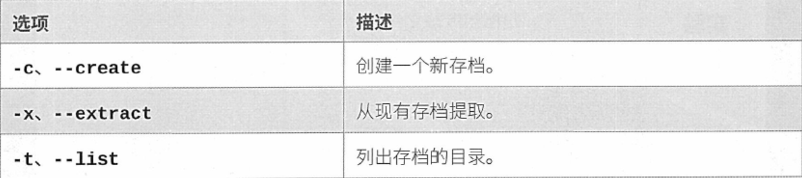
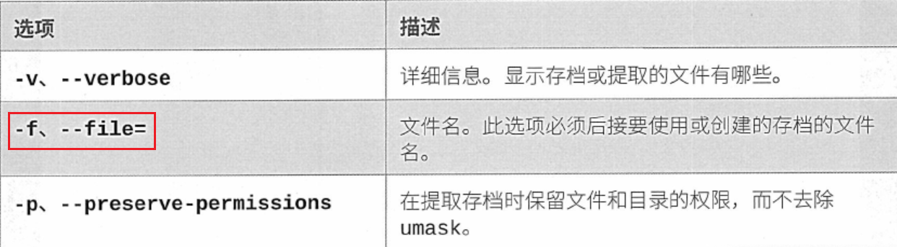
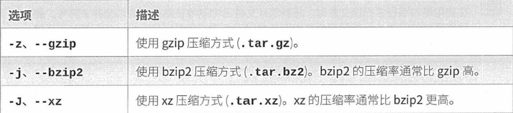

## tar

作用：使文件和目录归档压缩

tar的操作





tar的压缩选项



```bash
[kiosk@foundation0 tartest]$ tar -cf /home/kiosk/tartest/a.tar  /home/kiosk/tartest/file{1..3}
tar: Removing leading `/' from member names   #tar默认使用相对路径，用绝对路径打包解包时也会解包成绝对路径
 
 #查看打包内容
 [kiosk@foundation0 tartest]$ tar -tf a.tar 
home/kiosk/tartest/file1
home/kiosk/tartest/file2
home/kiosk/tartest/file3

#解包
[kiosk@foundation0 tartest]$ tar -xf file.tar 
[kiosk@foundation0 tartest]$ ls
file1  file2  file.tar

```

